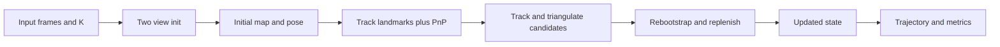
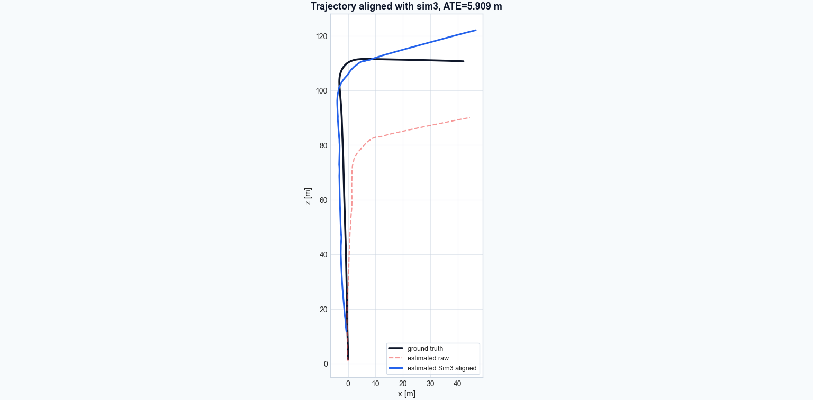
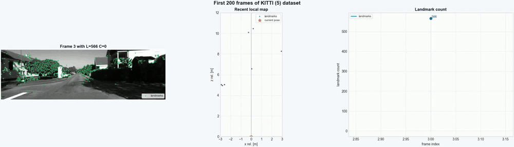

# Visual Odometry (Python)
This is a small **monocular** visual odometry pipeline in Python that estimates camera pose from image sequences.
It runs on KITTI (sequence 5) dataset using two view initialization, KLT tracking, PnP pose updates, and triangulation. It also includes live visualization and trajectory evaluation with alignment, ATE, and RTE metrics.

## Very basic block diagram

## Some results
Because this is a monocular implementation, scale drift is inevitable as shown in the plot below (first 200 frames). Due to this Sim3 is used.

Here is an animated preview of the whole pipeline running.

